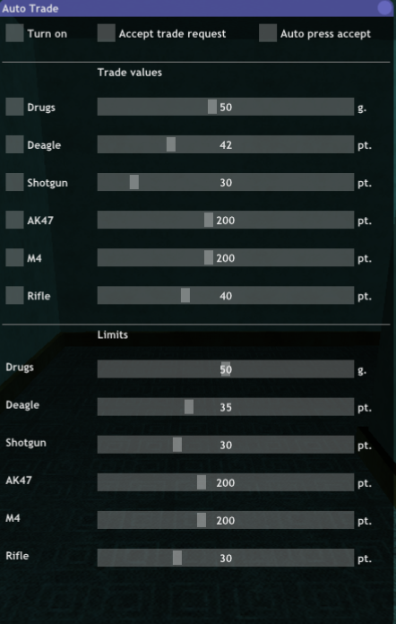

# Script for Automatic iTrade (Samp-Rp)

  

## Description

This script was created to automate the process of item trading between players. It allows trades to be executed automatically based on the parameters specified by the player, without requiring any manual actions.

## Instruction

- **Turn on** - activates the script for transferring items.

- **Accept trade request** - enables automatic acceptance of a trade when someone offers one.

- **Auto press accept** - automatically confirms the trade (clicking the "accept" button).

- **LMB + Q** - Sends the trade offer to the player in the target.

- **Trade values** - these are the values set for trading with a player. To input your own value, press Ctrl + LMB on the slider.

- **Limits** - allows you to set a minimum quantity below which items cannot be traded. For example, if you have 60 Deagle ammo, you set 20 for trading, but the limit is 50, the trade will only send 10 units (60 - 50 = 10).

## Activation

To activate the script, enter the following command in the chat. Set the parameter values, then close the window, and the script will start working.

> /atrade