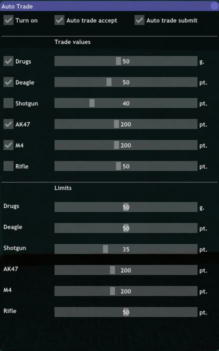

# Script for Automatic iTrade (Samp-Rp)

# [**Download**](auto_trade.lua)

Move the file `auto_trade.lua` to the `moonloader` folder.

 

## Description

This script was created to automate the process of item trading between players. It allows trades to be executed automatically based on the parameters specified by the player, without requiring any manual actions.

  

## Instruction

- **Turn on** - activates the script itself.
- **Auto trade accept** - enables automatic acceptance of a trade when someone offers one.
- **Auto trade submit** - automatically confirms the trade (clicking the "accept" button).
Trade values - these are the values set for trading with a player. To input your own value, press Ctrl + LMB on the slider.
- **Trade values** - these are the item values designated for transferring to another player.
- **Limits** - allows you to set a minimum quantity below which items cannot be traded. For example, if you have 60 Deagle ammo, you set 20 for trading, but the limit is 50, the trade will only send 10 units (60 - 50 = 10).

## Activation

### **/atrade**