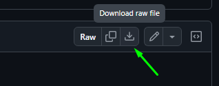
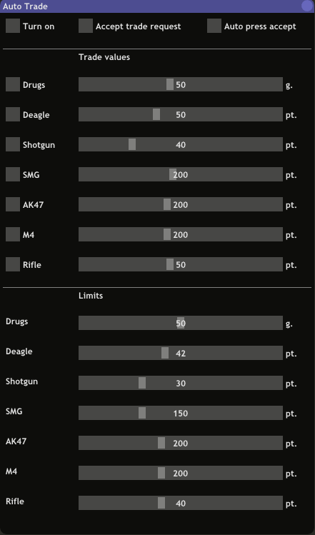

# Скрипт для автоматического трейда (Samp-Rp)

## [**Скачать**](auto_trade.lua)

Перенесите файл `auto_trade.lua` в папку `moonloader`.

 

  

## Описание

Этот скрипт был создан для автоматизации процесса обмена предметами между игроками во время трейда (/itrade). Он позволяет мгновенно выполнять обмен предметами на основе параметров, заданных игроком, без необходимости ручного вмешательства. Также, есть возможность для автоматического принятия трейда (**Auto press accept**) для игрока который получает предметы.

## Инструкция

- **Turn on** - Активирует автоматическую передачу предметов во время трейда.

- **Accept trade request** - Автоматическое принятие трейда (/accept invtrade) когда видит сообщение в чате.

- **Auto press accept** - Автоматически соглашается на обмен (кнопка accept). Во время **передачи** предметов кнопка accept будет нажиматься после того как все предметы были добавлены для обмена. Во время **принятия** предметов - после того как другой игрок согласился на обмен.

- **LMB + Q** - Отправляет предложения трейда игроку который находиться в прицеле (когда есть зелёная стрелка над игроком).

- **Trade values** - Значения которые нужно передавать во время трейда. Для указания собственного значения нужно нажать **CTRL + ЛКМ** по ползунку.

- **Limits** - Позволяет указывать лимиты (минимальные значения) за которые нельзя выходить. Например, если для *Дигла* указан лимит 50 патронов, для передачи указано 35, а у вас при этом осталось 60 патронов то во время трейда игроку передастся только 10 патронов. Если же лимит был достигнут либо вовсе превышает текущее количество патронов, предмет передаваться не будет.

## Активация

### /atrade
